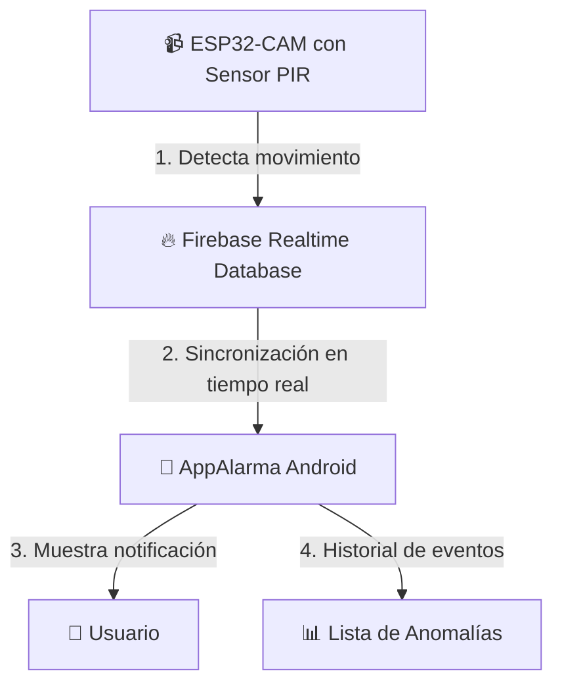

# 📹 Sistema de Alarma Inteligente con Detección de Movimiento

Este proyecto es un sistema de seguridad integral desarrollado en Android con Kotlin y Jetpack Compose. La aplicación está diseñada para recibir alertas de anomalías en tiempo real a través de Firebase Realtime Database y mostrar un historial completo de eventos detectados.

## 🏛️ Arquitectura del Sistema

El sistema utiliza una arquitectura moderna basada en:
- **MVVM (Model-View-ViewModel)** para separación de responsabilidades
- **Firebase Realtime Database** para almacenamiento y sincronización en tiempo real
- **Jetpack Compose** para una UI moderna y declarativa
- **LiveData** para observación reactiva de datos


## ✨ Características Principales

- **🔄 Sincronización en Tiempo Real**: Utiliza Firebase Realtime Database para recibir actualizaciones instantáneas de anomalías
- **🎨 Interfaz Moderna**: Construida completamente con Jetpack Compose y Material Design 3
- **🏗️ Arquitectura MVVM**: Implementa el patrón Model-View-ViewModel para un código limpio y mantenible
- **📱 UI Reactiva**: Utiliza LiveData para observación reactiva de cambios en los datos
- **📋 Historial Completo**: Muestra todas las anomalías registradas con timestamp y ubicación
- **🔊 Sonidos Personalizados**: Incluye múltiples tonos de alarma (Nokia Destiny, Escape, Home)
- **⚡ Rendimiento Optimizado**: Lista eficiente con LazyColumn para manejar grandes cantidades de datos
- **🎯 Notificaciones Push**: Preparado para recibir notificaciones de Firebase Cloud Messaging
## 🛠️ Tecnologías Utilizadas

| Componente | Tecnología | Versión |
|------------|------------|----------|
| **Lenguaje** | Kotlin | 2.0.21 |
| **UI Framework** | Jetpack Compose | 2024.09.00 |
| **Arquitectura** | MVVM + LiveData | - |
| **Base de Datos** | Firebase Realtime Database | 21.0.0 |
| **Notificaciones** | Firebase Cloud Messaging | - |
| **Build System** | Gradle (KTS) | 8.9.2 |
| **Min SDK** | Android 8.0 (API 26) | - |
| **Target SDK** | Android 14 (API 35) | - |
## 🚀 Configuración y Ejecución

### Prerrequisitos
- Android Studio (versión más reciente)
- JDK 11 o superior
- Dispositivo Android con API 26+ o emulador
- Cuenta de Firebase (para Realtime Database)

### 1. Configuración de Firebase
1. Crea un proyecto en [Firebase Console](https://console.firebase.google.com/)
2. Habilita **Realtime Database**
3. Descarga el archivo `google-services.json`
4. Colócalo en la carpeta `app/`

### 2. Configuración del Proyecto
```bash
# Clona el repositorio
git clone <repository-url>
cd app_alarma

# Abre el proyecto en Android Studio
# El proyecto se sincronizará automáticamente
```

### 3. Estructura de Datos en Firebase
Crea la siguiente estructura en tu Realtime Database:
```json
{
  "anomalies": {
    "anomaly1": {
      "timestamp": "2024-01-15 14:30:00",
      "location": "Entrada Principal"
    }
  }
}
```

### 4. Ejecución
1. Conecta tu dispositivo Android o inicia un emulador
2. Ejecuta la aplicación desde Android Studio
3. La app se conectará automáticamente a Firebase y mostrará las anomalías
## 📱 Uso de la Aplicación

1. **Visualización de Anomalías**: La pantalla principal muestra una lista de todas las anomalías detectadas
2. **Actualización en Tiempo Real**: Los nuevos eventos aparecen automáticamente sin necesidad de refrescar
3. **Información Detallada**: Cada anomalía muestra timestamp y ubicación
4. **Sonidos Incluidos**: La app incluye 3 tonos de alarma personalizados:
   - Nokia Destiny
   - Nokia Escape  
   - Nokia Home

## 📁 Estructura del Proyecto

```
app/
├── src/main/java/com/empresa/appalarma/
│   ├── data/
│   │   ├── model/Anomaly.kt              # Modelo de datos
│   │   └── repository/AnomalyRepository.kt # Repositorio Firebase
│   ├── ui/
│   │   ├── main/MainViewModel.kt         # ViewModel principal
│   │   └── theme/                        # Tema de la aplicación
│   ├── services/FirebaseAlarmService.kt  # Servicio FCM
│   ├── utils/NotificationHelper.kt       # Utilidades de notificación
│   └── MainActivity.kt                   # Activity principal
├── res/
│   ├── raw/                             # Archivos de sonido
│   └── values/                          # Recursos de la app
└── build.gradle.kts                     # Configuración de dependencias
```

## 🔧 Próximas Mejoras

- [ ] Implementación de API REST local
- [ ] Integración con ESP32-CAM
- [ ] Configuración de tonos de alarma desde la UI
- [ ] Filtros y búsqueda en el historial
- [ ] Modo oscuro
- [ ] Configuración de notificaciones push
